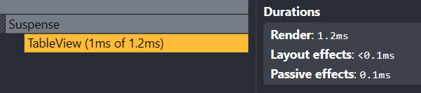
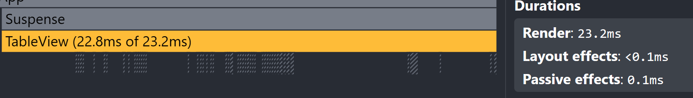

# Performace

### Performance Optimization with React.memo and useMemo

### Profiling Results

I compared the application performance before and after optimization by running the same set of actions:

- Sorting
- Searching
- Filtering by year

All of these interactions showed measurable improvements in render duration.
While the gains were only a few milliseconds, the profiling clearly indicates reduced rendering time — confirming that memoization helps, especially as data scales.

The optimizations includes:

- using useMemo to memoize the filtered, searched, and sorted list of countries and selected columns
- using useCallback to memoize event handler functions for filtering, searching, sorting, and column selection.
- using React.memo to wrap country component to prevent unnecessary re-renders.
- using proper key props for lists and tables to avoid reconciliation issues.

# Screenshots

1. Search responds faster with the same requests. The component uses the cached result and does not perform unnecessary calculations.

without optimization

vs with optimization

2. The same picture is observed with sorting. When selecting sorting several times in a row, useMemo prevents repeated heavy rerenders for country cards compoennnt, as we can see wrapping its compoennt in react.memo actually did good job

without optimization

vs with optimization

3.  When I selected the same year several times in a row. Change is not massive. But the calculation for changed year data will have to happen either way to keep it dynamic

without optimization

vs with optimization

